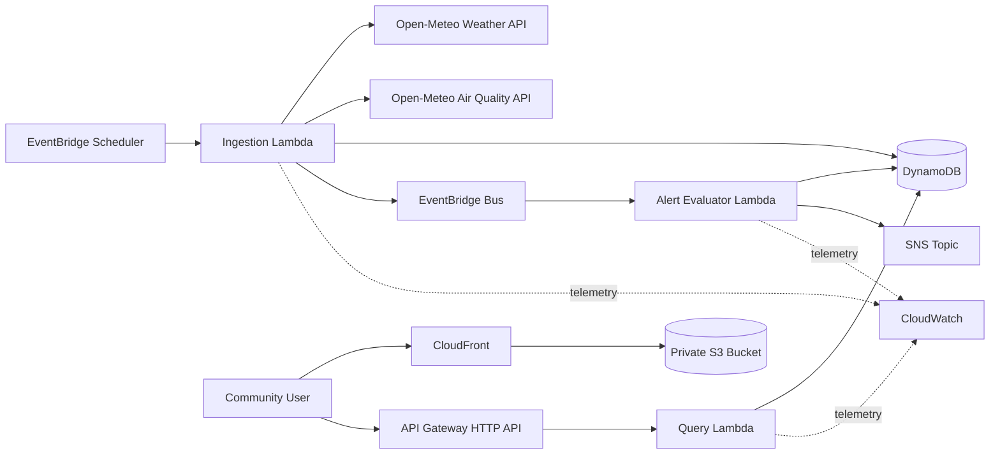

# AyniAlert Technical Design

## 1. Design Goals

- Deliver a working cloud vertical slice quickly.
- Keep domain logic independent from AWS handlers and external APIs.
- Make stale and invalid data visible rather than silently misleading users.
- Use managed, request-based AWS services appropriate for a low-traffic MVP.
- Preserve clear evolution paths without building multi-location or multi-region complexity prematurely.

## 2. Context

AyniAlert obtains public environmental data for the Corpac neighborhood in Lima, transforms it into a stable internal model, evaluates versioned informational thresholds, and serves the result through a public dashboard and API.

The system has three external actors:

1. Open-Meteo provides weather and air-quality measurements.
2. Community users read the dashboard and API.
3. Opt-in subscribers receive Amazon SNS notifications.

## 3. Architecture



### Delivery slices

The diagram shows the target MVP, but implementation proceeds in deployable slices:

1. **Walking skeleton:** health endpoint, table, ingestion Lambda, and manual invocation.
2. **Current conditions:** scheduled ingestion and latest-observation endpoint.
3. **Alerts:** event bus, evaluator, state transitions, and SNS.
4. **Experience:** Vue dashboard, history endpoint, CloudFront, and operational alarms.

This order produces evidence early and prevents the frontend or notification workflow from blocking the first deployment.

## 4. Backend Structure

```text
backend/
├── src/ayni_alert/
│   ├── domain/
│   │   ├── models.py
│   │   ├── alert_rules.py
│   │   └── errors.py
│   ├── application/
│   │   ├── ingest_observation.py
│   │   ├── evaluate_alerts.py
│   │   └── query_observations.py
│   ├── adapters/
│   │   ├── open_meteo.py
│   │   ├── dynamodb_repository.py
│   │   └── eventbridge_publisher.py
│   └── handlers/
│       ├── ingestion.py
│       ├── evaluation.py
│       └── api.py
└── tests/
    ├── unit/
    ├── integration/
    └── fixtures/
```

Handlers translate AWS events and responses. Application services coordinate use cases. Domain modules contain validation and alert rules. Adapters isolate provider and AWS SDK details. This separation keeps business rules testable without Lambda, DynamoDB, or internet access.

## 5. Observation Model

```json
{
  "schemaVersion": 1,
  "locationId": "LIMA_CORPAC",
  "providerObservedAt": "2026-09-26T15:00:00Z",
  "ingestedAt": "2026-09-26T15:03:12Z",
  "coordinates": {
    "latitude": -12.0982,
    "longitude": -77.0143
  },
  "measurements": {
    "apparentTemperatureC": 24.1,
    "uvIndex": 7.2,
    "usAqi": 84,
    "pm25UgM3": 18.4
  },
  "source": {
    "provider": "Open-Meteo",
    "weatherModel": "provider-selected",
    "airQualityModel": "provider-selected"
  }
}
```

Domain validation rejects non-finite values, missing timestamps, unsupported units, and responses that cannot be combined into a complete observation. The provider timestamp is preserved separately from ingestion time.

## 6. DynamoDB Design

### Table configuration

- Billing mode: on-demand
- Partition key: `PK` (string)
- Sort key: `SK` (string)
- Point-in-time recovery: enabled outside disposable development environments
- TTL attribute: `expiresAt`

### Items

```text
PK                       SK                               Purpose
LOCATION#LIMA_CORPAC     OBSERVATION#<RFC3339>            Observation history
LOCATION#LIMA_CORPAC     STATE#<ALERT_TYPE>               Current alert state
LOCATION#LIMA_CORPAC     ALERT#<RFC3339>#<ALERT_TYPE>     Alert transition history
```

Observation attributes include the normalized payload, `providerObservedAt`, `ingestedAt`, `schemaVersion`, and `expiresAt`. Conditional writes make ingestion idempotent.

### Access patterns

| Access pattern | Operation |
|---|---|
| Latest observation | Query `PK`, sort key begins with `OBSERVATION#`, descending, limit 1 |
| Bounded history | Query `PK` and sort-key range, descending, bounded limit |
| Current alert state | Get item by `PK` and `STATE#<TYPE>` |
| Alert history | Query `PK` and sort-key prefix/range for `ALERT#` |

No public request requires a scan or secondary index in the MVP.

## 7. Provider Integration

The Open-Meteo adapter performs two bounded-timeout HTTPS requests:

- Weather API: apparent temperature and UV index
- Air Quality API: US AQI and PM2.5

The adapter maps provider-specific responses into a provider-neutral candidate observation. The application service validates that timestamps are compatible before persistence. Exact provider parameters and attribution are covered by adapter tests and deployment documentation.

## 8. Alert Evaluation

Rules are configuration, not handler conditionals. A rule contains:

```text
id, version, measurement, enabled, severity bands, rationale, source URL
```

Initial rule types are `APPARENT_TEMPERATURE`, `UV_INDEX`, and `US_AQI`. Exact thresholds must be documented before enabling a production notification. Tests use explicit fixture rules so domain behavior does not depend on deployment configuration.

The evaluator compares the calculated result with the current state:

- Same status and severity: no transition and no notification.
- Inactive to active: store `OPENED`, update state, notify.
- Active severity change: store `SEVERITY_CHANGED`, update state, notify.
- Active to inactive: store `CLOSED`, update state, notify.

A conditional DynamoDB update prevents two deliveries of the same observation event from producing duplicate state transitions.

## 9. API Design

### Routes

```text
GET /health
GET /v1/locations/{locationId}/latest
GET /v1/locations/{locationId}/history?from=<time>&to=<time>&limit=<n>
```

### Response rules

- JSON responses use camelCase.
- Timestamps use RFC 3339 UTC.
- Measurements always include units.
- Errors contain `code`, `message`, and `correlationId`.
- Internal exceptions and stack traces are never returned.
- `Cache-Control` is explicit and conservative because freshness matters.

## 10. Security Design

- Separate IAM execution roles for ingestion, evaluation, and query functions.
- Query Lambda receives read-only access to the required table operations.
- Ingestion can conditionally write observations and publish only the expected event type and bus.
- Evaluator can read/update alert items and publish only to the project SNS topic.
- S3 blocks public access; CloudFront uses Origin Access Control.
- API Gateway exposes only documented `GET` routes and applies throttling.
- GitHub Actions will use OIDC rather than long-lived AWS access keys.
- Repository secret scanning and dependency checks are added before automated deployment.

## 11. Reliability and Failure Handling

| Failure | Behavior |
|---|---|
| Provider timeout or invalid response | Reject candidate, log structured failure, preserve latest valid observation |
| Duplicate scheduled invocation | Conditional write treats it as an idempotent success |
| Event target failure | EventBridge bounded retry, then SQS dead-letter queue |
| Alert evaluator duplicate delivery | Conditional state transition prevents duplicate notification |
| Missing recent data | API marks response stale; alarm activates after two hours |
| Frontend API failure | UI shows unavailable state and does not display cached data as current |

## 12. Observability

All backend logs use structured JSON with:

```text
timestamp, level, service, operation, outcome, correlationId, locationId
```

Sensitive data and full provider payloads are not logged by default. CloudWatch metrics cover ingestion outcomes, rejected responses, observation age, transition count, notification failures, API latency, and API errors.

## 13. Cost Controls

- Hourly ingestion produces approximately 720 scheduled runs per month.
- Lambda, HTTP API, DynamoDB on-demand, and EventBridge remain request-based.
- Observation TTL defaults to 30 days.
- CloudWatch log retention is explicit.
- AWS Budget and cost tags are deployment prerequisites.
- The first cost estimate must use current regional pricing rather than hard-coded README claims.

## 14. Testing Strategy

### Unit tests

- Provider response normalization and validation
- Timestamp compatibility
- Observation identity and TTL calculation
- Every alert transition, including duplicate delivery
- API parameter validation and error mapping

### Integration tests

- Repository behavior against DynamoDB Local or an isolated AWS test stack
- Handler event contracts
- SAM template validation

### End-to-end tests

- Scheduled or manual ingestion reaches the deployed table
- Public API returns the ingested observation
- Dashboard renders live API data
- Controlled fixture produces exactly one open and one close notification

## 15. Key Decisions and Trade-offs

1. **Serverless over containers:** Faster operations and pay-per-use fit the MVP; cold starts and cloud coupling are accepted.
2. **DynamoDB over a relational database:** Known key-based access patterns avoid operating a database; ad hoc analytics are deferred.
3. **EventBridge between ingestion and alerts:** Adds one managed component but prevents alert logic from coupling to provider ingestion.
4. **AWS SAM over Terraform or CDK:** Smaller initial serverless setup; broader multi-cloud provisioning is not currently required.
5. **No generative AI in the MVP:** Kiro assists development, but product AI is excluded until a user need justifies cost and risk.
