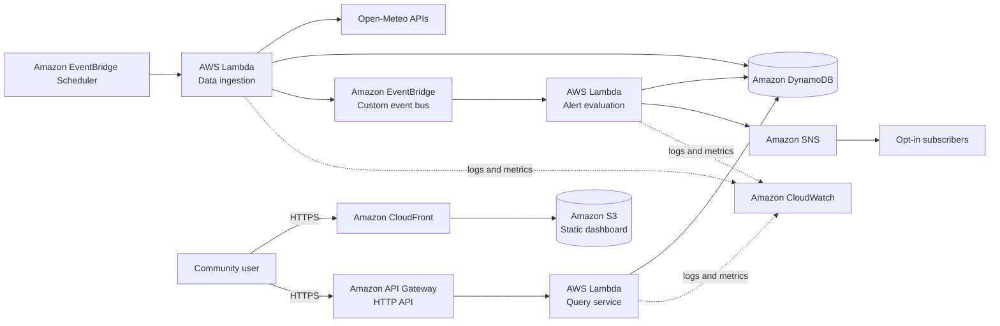

# AyniAlert

> A serverless community environmental alert platform for Lima, Peru.

[](#project-status)
[](#proposed-aws-architecture)
[](#technology-stack)

## Overview

AyniAlert is an in-development platform designed to make local environmental conditions easier to understand. It will periodically collect public weather and air-quality data for Lima, evaluate configurable risk thresholds, and expose the results through a public dashboard and opt-in notifications.

The first version focuses on three conditions:

- High apparent temperature
- High ultraviolet radiation
- Poor air quality

The project is intentionally starting with a small, deployable vertical slice. The goal is to demonstrate how a low-cost, event-driven AWS architecture can transform public data into accessible community information without claiming medical authority or replacing official emergency services.

## Problem

Environmental data is available from multiple sources, but raw measurements are not always easy to interpret quickly. People who exercise outdoors, work outside, care for older adults, or have environmental sensitivities may benefit from a simple view of current conditions and configurable warnings.

### Target users

- Residents checking conditions before outdoor activities
- Outdoor workers and commuters
- Caregivers supporting older adults or other vulnerable people
- Community organizations sharing local environmental information

## MVP Scope

The minimum viable product will:

1. Retrieve environmental data for one configured Lima location on a schedule.
2. Store normalized observations with timestamps and source metadata.
3. Evaluate configurable alert rules.
4. Expose current conditions and recent history through a read-only API.
5. Display the information in a public responsive dashboard.
6. Send opt-in notifications when an alert changes state.
7. Record operational metrics and failures in Amazon CloudWatch.

### Out of scope for the MVP

- Medical recommendations or diagnoses
- Emergency-response coordination
- User-submitted environmental measurements
- Machine-learning predictions
- Generative-AI summaries
- Native mobile applications
- Multi-region disaster recovery

These exclusions keep the first release small enough to deploy, observe, and improve using evidence rather than assumptions.

## Project Status

| Capability | Status |
|---|---|
| Problem statement and MVP scope | Documented |
| Proposed AWS architecture | Documented |
| Infrastructure as Code | Planned |
| Scheduled data ingestion | Planned |
| Alert evaluation | Planned |
| Read-only API | Planned |
| Public dashboard | Planned |
| Opt-in notifications | Planned |
| Automated tests and deployment pipeline | Planned |

No production deployment is claimed at this stage. Statuses will be updated as each capability is implemented and verified.

## Proposed AWS Architecture



### Request and event flow

1. EventBridge Scheduler invokes the ingestion Lambda at a configurable interval.
2. The function requests current data from the external provider, validates the response, and stores a normalized observation in DynamoDB.
3. The function publishes an `ObservationRecorded` domain event to EventBridge.
4. The evaluation Lambda applies versioned threshold rules and records any alert-state transition.
5. Amazon SNS notifies subscribers only when an alert opens, changes severity, or closes, reducing duplicate notifications.
6. The public dashboard retrieves current and historical data through a read-only HTTP API.

## Why These Services?

| Service | Responsibility | Rationale |
|---|---|---|
| EventBridge Scheduler | Periodic ingestion | Managed scheduling without continuously running compute |
| AWS Lambda | Ingestion, evaluation, and queries | Pay-per-use execution suitable for a low-volume MVP |
| DynamoDB | Observations and alert states | Serverless persistence with predictable key-based access patterns |
| EventBridge | Domain-event routing | Decouples ingestion from alert evaluation and future consumers |
| API Gateway HTTP API | Public read-only endpoints | Managed HTTPS endpoint with throttling and lower complexity than operating a server |
| SNS | Opt-in notifications | Managed fan-out and subscription confirmation |
| S3 and CloudFront | Static web application | Low-maintenance hosting, caching, HTTPS, and private S3 origin access |
| CloudWatch | Logs, metrics, dashboards, and alarms | Centralized operational visibility across serverless components |
| AWS SAM | Infrastructure as Code | Repeatable serverless deployments using a small declarative template |

The architecture will be revised when implementation evidence exposes different requirements. Services are selected to solve specific responsibilities, not to maximize the number of AWS products used.

## Quality Attributes

### Cost efficiency

- Prefer on-demand, pay-per-request services.
- Cache static assets at the edge.
- Apply DynamoDB expiration to observations that no longer require detailed retention.
- Configure AWS Budgets before deploying shared or recurring resources.
- Document an AWS Pricing Calculator estimate before the first public release.

### Reliability

- Validate external responses before persistence.
- Make scheduled ingestion idempotent using location and observation time.
- Configure bounded retries and dead-letter handling for failed event deliveries.
- Preserve the last successful observation while clearly displaying its timestamp and freshness.
- Notify operators when ingestion has not succeeded within the expected interval.

### Security

- Block all public access to the S3 bucket and use CloudFront Origin Access Control.
- Expose only read operations through the public API.
- Apply least-privilege IAM policies to every Lambda function.
- Enforce HTTPS, API throttling, log retention, and dependency scanning.
- Avoid storing subscriber contact details in the application database; SNS manages confirmed subscriptions.
- Store no AWS credentials or secrets in the repository.

### Performance

- Design API access around known DynamoDB partition and sort keys.
- Return bounded time ranges rather than unbounded observation histories.
- Cache static assets through CloudFront.
- Measure API latency before introducing additional caching.

### Observability

- Emit structured JSON logs with correlation identifiers.
- Track ingestion success, provider errors, stale data, alert transitions, and API failures.
- Create CloudWatch alarms for repeated ingestion failures and Lambda errors.
- Maintain a small operational dashboard for system health.

## Data Model — Initial Proposal

A single DynamoDB table is proposed for the MVP:

```text
PK                       SK                              Entity
LOCATION#LIMA_CORPAC     OBSERVATION#<ISO-8601>          Environmental observation
LOCATION#LIMA_CORPAC     ALERT#<TYPE>#<OPENED_AT>        Alert history
LOCATION#LIMA_CORPAC     STATE#<TYPE>                    Current alert state
```

The model supports the initial access patterns:

- Get the latest observation for a location.
- List observations for a bounded time range.
- Get current alert states.
- List recent alert transitions.

The design will not be generalized for multiple locations until that requirement is implemented.

## Data Source and Responsible Use

The MVP plans to use the [Open-Meteo Weather API](https://open-meteo.com/en/docs) and [Open-Meteo Air Quality API](https://open-meteo.com/en/docs/air-quality-api). Provider attribution, licensing, request limits, and usage conditions will be reviewed before public deployment.

Alert thresholds will be configurable and documented with their sources. AyniAlert will display measurement timestamps and data freshness so users can distinguish current information from stale data.

> **Disclaimer:** AyniAlert is an educational project and an informational tool. It is not a medical device, an official warning system, or a substitute for guidance from health authorities, emergency services, SENAMHI, or other official agencies.

## Technology Stack

- **Cloud:** AWS
- **Infrastructure as Code:** AWS SAM
- **Backend:** Python 3.13 on AWS Lambda
- **API:** Amazon API Gateway HTTP API
- **Database:** Amazon DynamoDB
- **Frontend:** Vue 3 and TypeScript
- **Testing:** pytest, Vitest, and Playwright
- **CI/CD:** GitHub Actions with short-lived AWS credentials through OpenID Connect
- **Development workflow:** Kiro specs, Git, and Architecture Decision Records

## Planned Repository Structure

```text
.
├── .github/workflows/       # Validation and deployment workflows
├── .kiro/specs/ayni-alert/  # Requirements, design, and implementation tasks
├── backend/
│   ├── functions/           # Lambda handlers and application modules
│   └── tests/
├── frontend/                # Public Vue dashboard
├── infrastructure/          # AWS SAM templates and deployment configuration
├── docs/
│   ├── adr/                 # Architecture Decision Records
│   └── diagrams/            # Exported architecture diagrams
└── README.md
```

## Delivery Roadmap

### Phase 1 — Walking skeleton

- Define requirements and acceptance criteria in Kiro.
- Create the SAM application and least-privilege IAM roles.
- Ingest and persist one real observation on a schedule.
- Expose a health endpoint and the latest observation.

### Phase 2 — Functional MVP

- Implement threshold evaluation and alert-state transitions.
- Add the Vue dashboard and recent observation history.
- Add opt-in SNS notifications.
- Add structured logs, alarms, tests, and a cost estimate.
- Publish the first deployment and document verification evidence.

### Phase 3 — Evidence-driven improvements

- Gather usability feedback.
- Add locations only when supported by a validated use case.
- Review the workload against the AWS Well-Architected Framework.
- Evaluate whether forecasting or generated summaries add measurable value.

## Architecture Decisions

Architecture decisions will be recorded under `docs/adr/`. Initial decisions to document include:

- ADR-001: Use a serverless architecture for the MVP.
- ADR-002: Use DynamoDB with explicit access patterns.
- ADR-003: Separate ingestion from alert evaluation using domain events.
- ADR-004: Use AWS SAM for repeatable deployments.
- ADR-005: Keep generative AI outside the MVP.

## Kiro-Assisted Development

Kiro will be used to refine requirements, design documents, implementation tasks, and code. Generated output will be reviewed, tested, and owned by the project author. AI assistance does not replace architectural reasoning, security review, or validation against deployed behavior.

## Success Criteria for the First Release

The first release will be considered functional when:

- Infrastructure can be deployed reproducibly from the repository.
- A scheduled execution stores valid environmental observations.
- The public API returns the latest observation and its freshness.
- The dashboard displays real data from the deployed API.
- One configured threshold can open and close an alert without duplicate notifications.
- Automated tests pass and operational alarms are configured.
- The README links to deployment evidence and an architecture-cost estimate.

## Author

**Manuel Malpartida Huamán**  
Systems Engineering student at the University of Lima  
[LinkedIn](https://www.linkedin.com/in/manuel-malpartida) · [GitHub](https://github.com/ManuelMH16)

## License

License selection is pending before the first public release.
